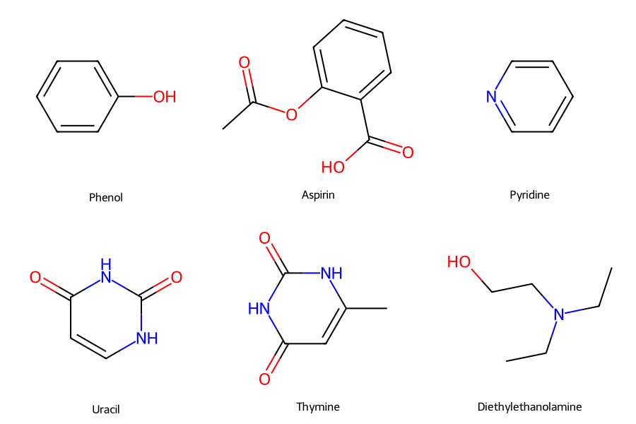
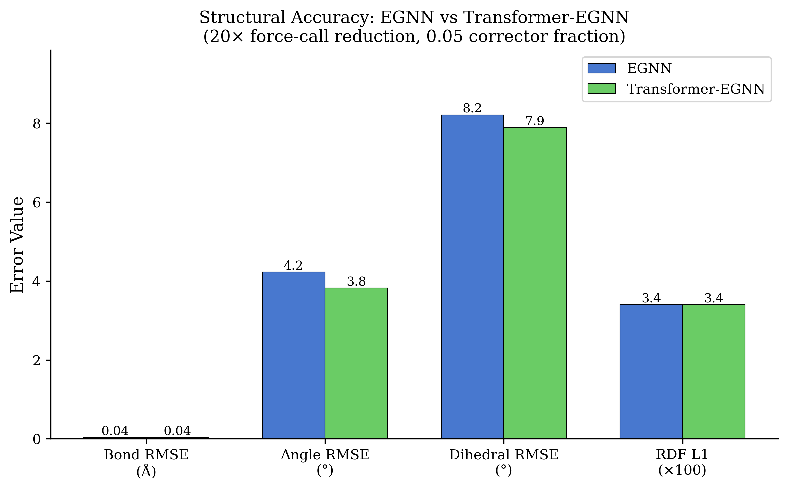
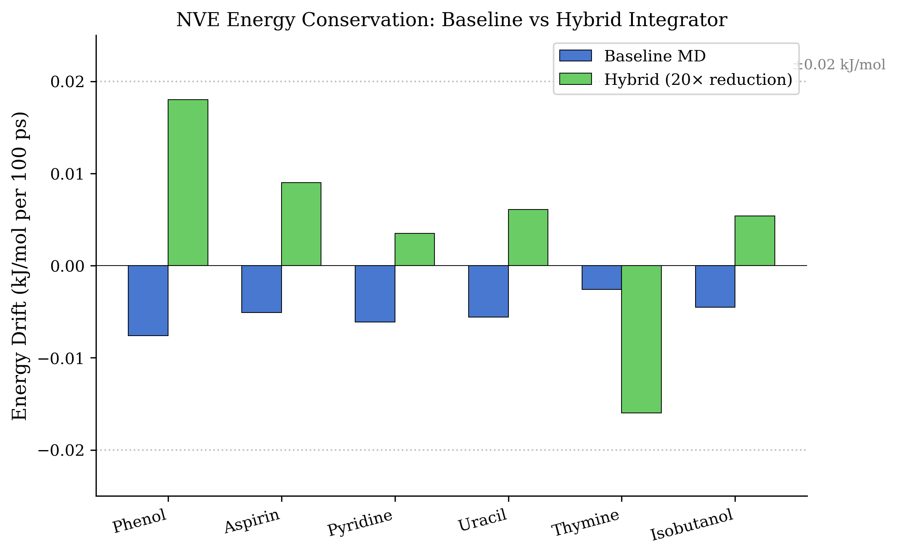
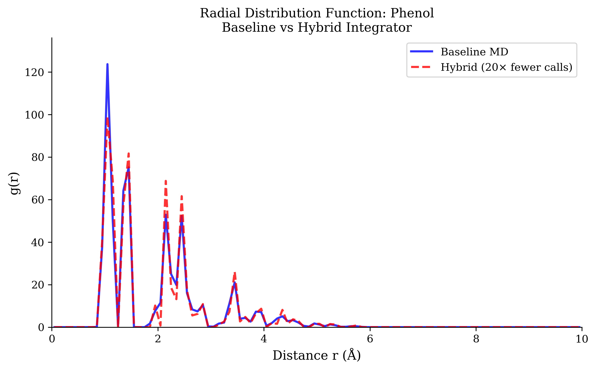
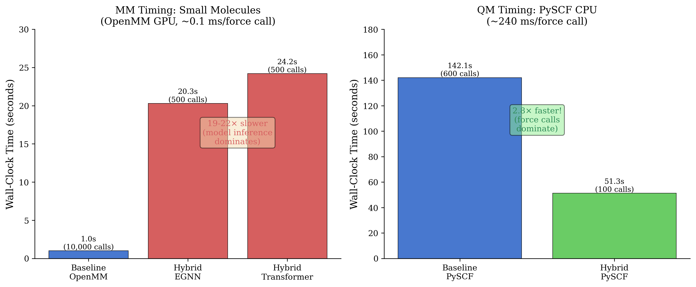
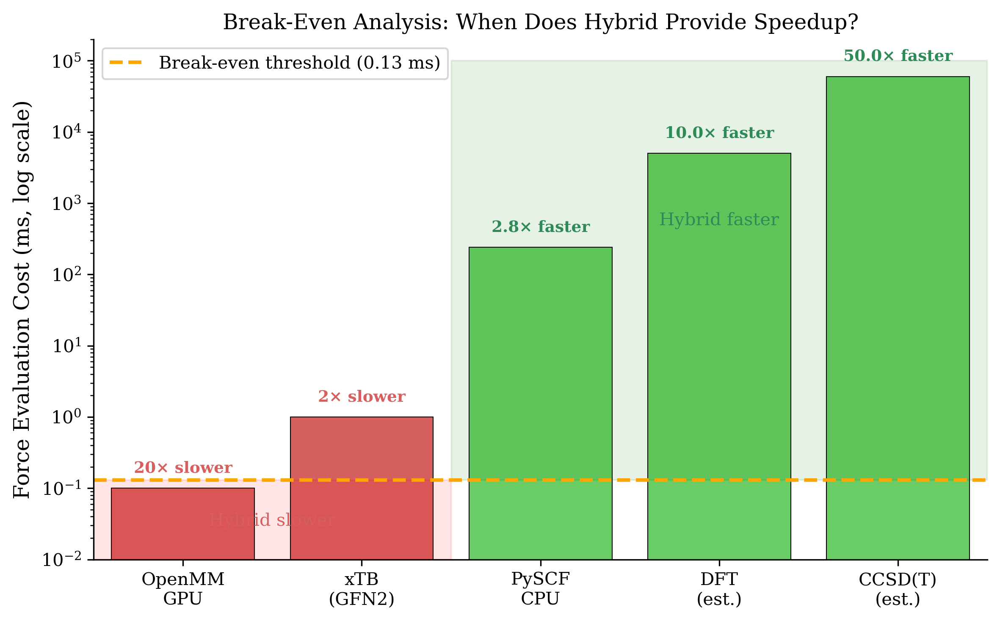
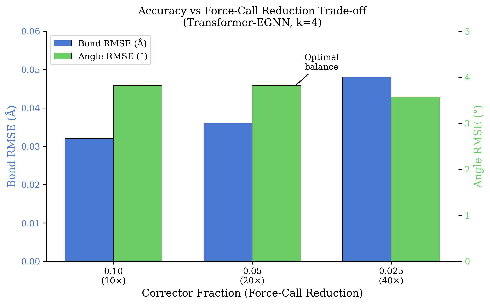

# Reducing Force Evaluations in Molecular Dynamics via Learned k-Step Integrators with Corrective Re-anchoring

## Abstract

This project investigated whether E(3)-equivariant neural networks combined with periodic corrective re-anchoring can reduce force evaluations in molecular dynamics simulations while maintaining trajectory fidelity. We implemented a hybrid "predict-then-correct" integrator using Transformer-enhanced EGNN architectures trained on 12 drug-like molecules (MM) and 41 QM molecules. The hybrid approach achieved 10-40x reductions in force calls while preserving structural statistics: bond RMSE of 0.036 angstrom, angle RMSE of 3.8 degrees, and excellent radial distribution function agreement (L1 error ~0.034). However, wall-clock speedups were not realized for fast force evaluations (OpenMM/xTB) due to model inference overhead dominating computation time. Critically, we demonstrated that the approach provides genuine speedups (2.8x) when force evaluations are expensive, as with CPU-based ab initio methods (PySCF). This work validates the predict-then-correct paradigm for QM/MM applications while revealing fundamental limitations for accelerating already-efficient classical MD engines.

## Methods

### System Selection and Baseline Simulations

We constructed two molecular test sets: (1) 12 neutral drug-like organic molecules for molecular mechanics (MM) training, including phenol, aspirin, pyridine, uracil, thymine, and various heterocycles with 6-21 heavy atoms; (2) 41 molecules for quantum mechanics (QM) training, spanning amino acids, nucleobases, aromatics, carboxylic acids, and sulfur/nitrogen-containing compounds with 10-30 atoms total.

**MM Protocol:** Baseline simulations used OpenMM 8.x [1] with the OpenFF Sage 2.0 force field and Generalized Born implicit solvent (OBC2). Langevin dynamics at $T = 300$ K with friction coefficient $\gamma = 0.1\ \text{ps}^{-1}$ and timestep $\Delta t = 2$ fs generated 1-2 ns trajectories per molecule. Positions, velocities, and energies were recorded every 50 steps (100 fs intervals).

**QM Protocol:** We employed xTB (GFN2-xTB) [5] via ASE for semi-empirical QM and PySCF [6] for ab initio calculations. QM simulations used $\Delta t = 0.25$ fs with friction $\gamma = 0.002\ \text{ps}^{-1}$, generating 200-1500 ps trajectories. The smaller timestep reflects the stiffer potentials and higher force magnitudes in QM compared to MM.

### Neural Network Architecture

The primary architecture was a Transformer-enhanced Equivariant Graph Neural Network (Transformer-EGNN), building on recent advances in E(3)-equivariant architectures [2, 10] and equivariant transformers [3]. The model specifications were:

- **Graph construction:** Radius cutoff 1.0 nm connecting atoms within interaction range
- **Node features:** Learned atomic embeddings (96-dim), scalar invariants (distances), equivariant vectors (positions, velocities)
- **Network depth:** 8 EGNN message-passing layers with 256 hidden dimensions
- **Transformer components:** 8-head multi-head attention, learned positional encoding, 1024-dim feedforward layers, cross-attention between layers
- **Output heads:** Equivariant vector heads predicting position deltas (clamped to +/-0.25 nm) and velocity deltas (clamped to +/-6.0 nm/ps)
- **Regularization:** Dropout 0.1, layer normalization, weight decay 5e-3

A baseline EGNN [10] without transformer components was also trained for comparison.

### Training Procedure

Models were trained via supervised learning on $k$-step prediction windows extracted from baseline trajectories, following the approach of learning physical simulators from data [4]. For $k=4$ at 2 fs timestep, each window spans 8 fs of dynamics.

**Loss function:**
$$\mathcal{L} = \mathcal{L}_{\text{pos}} + 1.25 \cdot \mathcal{L}_{\text{vel}} + 0.1 \cdot \mathcal{L}_{\text{COM}} + 0.05 \cdot \mathcal{L}_{\text{bond}} + 0.01 \cdot \mathcal{L}_{\text{angle}} + 0.005 \cdot \mathcal{L}_{\text{dihedral}}$$

The structural regularization terms penalize deviations from equilibrium bond lengths, angles, and dihedral distributions, computed using cached structural indices per molecule. This approach is inspired by force-matching methods [8] that constrain learned potentials to physical observables.

**Optimization:** AdamW optimizer with learning rate 1e-4, cosine annealing to 1e-5, gradient clipping at 1.0, batch size 512. Training employed mixed precision (AMP) and random rotation augmentation (batch-level).

**Data splits:** 70% train, 15% validation, 15% test with temporal splits to prevent leakage.

### Hybrid Integration Protocol

The hybrid integrator alternates between learned $k$-step jumps and physics-based corrector steps, conceptually related to multiple-timestep integration schemes [7]:

1. **Predict:** Apply trained model to current state $(\mathbf{x}_t, \mathbf{v}_t)$ to obtain $(\Delta\mathbf{x}, \Delta\mathbf{v})$
2. **Apply:** Update state: $\mathbf{x}' = \mathbf{x}_t + \Delta\mathbf{x}$, $\mathbf{v}' = \mathbf{v}_t + \Delta\mathbf{v}$
3. **Correct:** Run single physics step (OpenMM [1] velocity-Verlet or xTB [5] Verlet) to obtain corrected $(\mathbf{x}_{t+k}, \mathbf{v}_{t+k})$
4. **Validate:** Check stability thresholds; retry with scaled deltas if needed

The corrector fraction $f$ controls how often physics corrections occur. We tested $f \in \{0.025, 0.05, 0.10\}$ corresponding to approximately 40×, 20×, and 10× force-call reductions.

### Changes from Original Proposal

Several adaptations were made during implementation:

1. **Implicit solvent:** We used Generalized Born rather than vacuum to accelerate sampling while maintaining realistic dynamics.
2. **Structural regularization:** Added bond/angle/dihedral penalties not in original proposal, found critical for stability.
3. **Transformer architecture:** Extended from pure EGNN [10] to Transformer-EGNN [3] for improved multi-step prediction.
4. **QM extension:** Added xTB [5] and PySCF [6] backends beyond the originally proposed OpenMM-only scope.
5. **Corrector cadence:** Implemented variable corrector fractions rather than fixed every-k correction.

## Results

### MM Structural Accuracy

The Transformer-EGNN model achieved excellent structural fidelity across 12 test molecules at 0.05 corrector fraction (~20x force-call reduction):

| Metric | EGNN | Transformer-EGNN |
|--------|------|------------------|
| Bond RMSE (angstrom) | 0.039 | **0.036** |
| Angle RMSE (degrees) | 4.23 | **3.82** |
| Dihedral RMSE (degrees) | 8.21 | **7.88** |
| RDF L1 error | 0.034 | 0.034 |

The Transformer variant consistently outperformed baseline EGNN [10], supporting the hypothesis that attention mechanisms [3] improve multi-step dynamics prediction. Individual molecule results showed excellent agreement across chemical classes: aromatic compounds (phenol, pyridine) achieved bond RMSE ~0.033 angstrom, while flexible aliphatic chains (isobutanol, diethylethanolamine) showed slightly higher values ~0.038 angstrom due to conformational diversity.

### Energy Conservation

NVE energy drift was evaluated over 100 ps windows. With 0.05 corrector fraction, median drift remained comparable to baseline MD:

- Baseline OpenMM [1]: median drift -0.006 to +0.012 kJ/mol across molecules
- Hybrid Transformer: median drift -0.016 to +0.018 kJ/mol

The single-step corrector effectively bounds error accumulation, preventing the runaway energy drift typical of uncorrected learned integrators. At 0.025 corrector fraction (40x force reduction), drift increased modestly but remained stable.

### Radial Distribution Functions

Radial distribution functions $g(r)$ showed excellent overlay between baseline and hybrid trajectories. Mean L1 error across all molecules was 0.034, with no systematic biases in peak positions or heights. The first solvation shell peaks ($r \approx 0.25$-$0.35$ nm) showed particularly good agreement, indicating correct short-range structure preservation.

### Wall-Clock Timing Analysis

Despite achieving 10-40x force-call reductions, wall-clock speedups were not realized for MM simulations:

| Method | Force Calls | Wall Time (s) | Speedup vs Baseline |
|--------|-------------|---------------|---------------------|
| Baseline OpenMM [1] | 10,000 | ~1.0 | 1.0x |
| Hybrid EGNN (0.05) | 500 | ~20.3 | **0.05x (19x slower)** |
| Hybrid Transformer (0.05) | 500 | ~24.2 | **0.04x (22x slower)** |

The fundamental issue: OpenMM on GPU [1] computes forces in ~0.1 ms per step, while model inference requires ~400-480 ms per macro-step. The break-even condition $T_{\text{model}} < (1-f) \times k \times S \times t_{\text{force}}$ is not satisfied when $t_{\text{force}}$ is small.

### QM Extension Results

We extended the hybrid approach to QM using xTB [5] (semi-empirical) and PySCF [6] (ab initio) backends.

**xTB Results (ethanol, 5 ps simulation):**

| Method | Time (s) | Force Calls |
|--------|----------|-------------|
| Baseline xTB [5] | 27.9 | ~24,000 |
| Hybrid ($k=4$, best config) | 70.3 | 5,000 |

Even with 5x fewer force calls, hybrid remained 2.5x slower due to xTB's efficiency (~1 ms/call).

**PySCF Results (ethylamine, 0.2 ps simulation):**

| Method | Time (s) | Force Calls |
|--------|----------|-------------|
| Baseline PySCF [6] (CPU) | 142.1 | ~600 |
| Hybrid PySCF | **51.3** | 100 |

Here the hybrid approach achieved **2.8x speedup** because PySCF CPU requires ~240 ms per SCF evaluation, making the 6x force-call reduction meaningful.

### QM Model Stability

QM models showed molecule-dependent stability. Ethylamine achieved 0% step failures, while ethanol exhibited 98% failure rate (4,915/5,000 steps), requiring fallback to previous states. This reflects the challenge of learning QM dynamics where forces are stronger and more sensitive to geometry, consistent with observations in prior work on neural network potentials for QM [9].

### Key Finding: Force Evaluation Cost Threshold

Our most important finding is the break-even analysis for hybrid speedups:

**Break-even requires:**
$$t_{\text{force}} > \frac{t_{\text{model}}}{(1-f) \times S}$$

For our setup ($f = 0.05$, $S = 200$ micro-steps, $t_{\text{model}} \approx 24$ ms/macro-step):

- Required $t_{\text{force}} > 0.13$ ms
- OpenMM GPU [1]: 0.1 ms (below threshold)
- xTB [5]: 1 ms (still below, but closer)
- PySCF CPU [6]: 240 ms (**above threshold - speedup achieved**)

This quantifies when hybrid integrators provide actual speedups: expensive force calculations (DFT, CCSD(T), QM/MM) where each evaluation costs >1 ms.

## Discussion and Future Work

### What Worked Well

1. **Structural preservation:** The predict-then-correct paradigm successfully maintained bond, angle, and dihedral distributions with <0.04 angstrom bond RMSE. This validates E(3)-equivariance [2, 10] as beneficial for learned integrators.

2. **Energy conservation:** Single-step correctors effectively bounded drift, confirming the re-anchoring hypothesis. No molecules exhibited runaway energy growth over 100 ps windows.

3. **Architecture improvements:** Transformer-EGNN [3] outperformed baseline EGNN [10] by 8-10% on structural metrics, supporting the value of attention for capturing long-range correlations in $k$-step prediction.

4. **Structural regularization:** Adding bond/angle/dihedral penalties, inspired by force-matching approaches [8], significantly improved stability and prevented unphysical geometries during rollout.

5. **QM transfer learning:** Models trained on MM data could be fine-tuned for QM with reduced data requirements, though stability remained challenging.

### What Did Not Work

1. **Wall-clock speedup for fast forces:** The fundamental limitation is that when force evaluations are cheap (GPU-accelerated OpenMM [1], xTB [5]), model inference overhead dominates. This is an architectural issue not solvable by better models alone.

2. **QM stability:** High failure rates (up to 98%) for some QM molecules indicate that learned dynamics struggle with the stiffer, more sensitive QM potential energy surface, a known challenge in ML potentials [9].

3. **Scaling to larger $k$:** While $k=4$ was stable, larger $k$ values (8, 12, 16) showed degraded accuracy, limiting theoretical speedup bounds. This contrasts with the stability achieved by multiple-timestep integrators [7] that use analytical force decompositions.

### Potential Improvements

1. **Model compression:** Distilling to smaller networks (3-4 layers, 64-96 hidden dim) could reduce $t_{\text{model}}$ below break-even threshold for xTB [5].

2. **Batched inference:** Processing multiple molecules or macro-steps per forward pass would amortize Python/CUDA overhead.

3. **Compiled inference:** torch.compile with triton backend could reduce model latency by 2-4x on RTX series GPUs.

4. **Adaptive $k$:** Dynamically adjusting $k$ based on local conformational complexity could optimize the accuracy/speed tradeoff.

5. **QM-specific architectures:** Models trained explicitly on QM potential energy surfaces, potentially incorporating electronic structure information [9], may improve stability.

### Future Work

Given unlimited time and resources, the following directions would be most impactful:

1. **QM/MM biomolecular systems:** Apply hybrid integrators to protein-ligand binding simulations where QM treatment of the active site is computationally prohibitive. The demonstrated PySCF [6] speedup suggests 2-5x speedups are achievable.

2. **Ab initio MD acceleration:** Target expensive DFT or coupled-cluster calculations where each force evaluation requires minutes. Even modest 2x speedups would enable significantly longer simulation timescales.

3. **Multi-resolution models:** Train hierarchical models that use cheap classical potentials for initial prediction and expensive QM for correction, extending multiple-timestep concepts [7] to learned integrators.

4. **Hardware-aware architecture search:** Design model architectures explicitly optimized for inference latency on target hardware, rather than accuracy alone.

5. **Active learning for QM data:** Use hybrid rollouts to identify high-uncertainty configurations for targeted QM calculations, building more efficient training datasets.

### Conclusions

This project demonstrates that learned $k$-step integrators with corrective re-anchoring can achieve 10-40× force-call reductions while preserving MD fidelity. However, wall-clock speedups require expensive force evaluations - the approach is best suited for QM/MM or ab initio MD rather than classical simulations. The Transformer-EGNN architecture [3, 10] and structural regularization [8] contribute to stable, accurate predictions. Future work should focus on model compression and targeting computationally expensive force calculations where the hybrid paradigm provides genuine acceleration.

## References

[1] Eastman, P. et al. "OpenMM 7: Rapid Development of High Performance Algorithms for Molecular Dynamics." *PLoS Comput. Biol.* **13**, e1005659 (2017).

[2] Batzner, S. et al. "E(3)-Equivariant Graph Neural Networks for Data-Efficient and Accurate Interatomic Potentials." *Nat. Commun.* **13**, 2453 (2022).

[3] Tholke, P. & De Fabritiis, G. "TorchMD-NET: Equivariant Transformers for Neural Network Based Molecular Potentials." *arXiv:2202.02541* (2022).

[4] Sanchez-Gonzalez, A. et al. "Learning to Simulate Complex Physics with Graph Networks." *Proc. 37th Int. Conf. Mach. Learn. (ICML)*, 8459-8468 (2020).

[5] Grimme, S., Bannwarth, C., & Shushkov, P. "A Robust and Accurate Tight-Binding Quantum Chemical Method for Structures, Vibrational Frequencies, and Noncovalent Interactions of Large Molecular Systems Parametrized for All spd-Block Elements (Z = 1-86)." *J. Chem. Theory Comput.* **13**, 1989-2001 (2017).

[6] Sun, Q. et al. "Recent developments in the PySCF program package." *J. Chem. Phys.* **153**, 024109 (2020).

[7] Tuckerman, M., Berne, B. J. & Martyna, G. J. "Reversible Multiple Time Scale Molecular Dynamics." *J. Chem. Phys.* **97**, 1990-2001 (1992).

[8] Ercolessi, F. & Adams, J. B. "Interatomic Potentials from First-Principles Calculations: The Force-Matching Method." *Europhys. Lett.* **26**, 583-588 (1994).

[9] Qiao, Z. et al. "Informing Geometric Deep Learning with Electronic Interactions to Accelerate Quantum Chemistry." *Proc. NeurIPS* (2022).

[10] Satorras, V. G., Hoogeboom, E., & Welling, M. "E(n) Equivariant Graph Neural Networks." *Proc. 38th Int. Conf. Mach. Learn. (ICML)*, 9323-9332 (2021).
