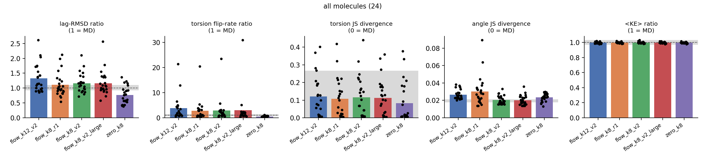

# Revisiting md-kstep (October 2026)

This note records what was wrong with the December 2025 version, what changed, and what
the rebuilt pipeline shows. Results are in [§3](#3-results); everything was run on phalanx
(RTX 5070 Ti, WSL2) on 2026-10-07.

## 1. Problems found in the 2025 version

| # | Problem | Consequence |
|---|---|---|
| 1 | **The "equivariant" models were not equivariant.** Δx/Δv came from `Linear(h)` on node features. Those features included raw velocity vectors (`vel_proj(vel)`), the EGNN coordinate updates were discarded, and the `tanh` clamp acted per Cartesian component. | Rotating the input changed the prediction by **137 %** (Δx) and 43 % (Δv) relative to the correctly rotated answer (Transformer-EGNN `checkpoints_transformer_aug_wide`). Random-rotation augmentation could not fix this. |
| 2 | **No control and no noise floor.** The default `--delta-scale 0.5` halved every jump, and the result then got 10 Langevin steps, which repair the structure on their own. Metrics were frame-by-frame RMSEs between two trajectories that decorrelate within ~100 fs. | The reported structural accuracy could not separate the model from "no model". Dihedral RMSEs of ~25° on flexible molecules are just two independent samples. |
| 3 | **Deterministic regression on stochastic data.** Targets were 400 fs ahead along Langevin trajectories. | An MSE model can only learn the conditional mean, which is not a valid dynamics sample. |
| 4 | **QM claims and units.** The xTB k=4 jump was only 1 fs. In the ethanol run 4,915 of 5,000 steps failed. The PySCF "2.8× faster" compared 100 hybrid calls with ~600 baseline calls, equilibration included. ASE velocities were treated as Å/fs (they are Å per ASE time unit ≈ 10.18 fs), so stored QM velocities were ~10.2× too large. Langevin friction was ~100× too small. | QM datasets had mislabelled Δv targets; timing comparisons were not like-for-like. |
| 5 | **Speed.** 8-layer, 256-wide transformer on ~15 atoms; neighbour graph rebuilt in a Python loop every call; the baseline time was extrapolated from 2–5 un-warmed macro-steps. | "Hybrid ~20× slower than MD", mostly from launch overhead and measurement. |
| 6 | **Hygiene and correctness.** No tests or CI; a 1,300-line trainer; the `lambda_force` "force loss" penalised `force_pred²` (pushing it to zero) instead of matching forces; config keys that did nothing (`attention_heads`, `use_cross_attention`); `configs/model.yaml` no longer matched the EGNN checkpoint; checkpoint directories silently renamed for transformers; pickled object-array datasets; a duplicate `md-kstep-cursor/` tree; 11 overlapping docs. | Hard to trust, hard to change. |

## 2. What changed

**Model (`src/kstep/model.py`).** The new backbone is a PaiNN-style message-passing
network on the fully connected intra-molecular graph, with a smooth cosine cutoff.
Vector inputs (velocity, and noisy Δ for the flow) enter only through bias-free channel
mixing and dot products, and outputs are built from vector features. The model is
therefore exactly E(3)-equivariant, translation-invariant and permutation-equivariant
(error ~1e-7). Inputs and targets are normalised per element with tables fitted on the
training split and stored in the checkpoint. Predictions are projected so that the COM
displacement and net momentum are exactly zero. There are two heads:

* `kind: mean`: deterministic regression (the old objective, now equivariant).
* `kind: flow`: **conditional flow matching**. The network learns a velocity field
  that carries isotropic Gaussian noise to samples of p(Δx, Δv | x_t, v_t). Sampling uses
  8 Heun steps by default. Isotropic noise plus an equivariant field makes the sampled
  distribution equivariant too. Rollouts are stochastic, like the Langevin reference.

**Training (`src/04_train.py`, ~200 lines).** The data lives on the GPU and batches are
gathered with vectorised indexing. AdamW, warmup + cosine LR, EMA, gradient clipping;
validation uses fixed noise so losses are comparable. Checkpoints are self-describing
(config + normalisation + k).

**Hybrid loop (`src/kstep/hybrid.py`), shared by OpenMM and xTB/PySCF.**
* A proposal is checked before the corrector runs: values must be finite and no bond may
  be strained by more than 25 %. Rejected proposals are redrawn (flow) or halved (mean).
* After `max_attempts` rejections the macro-step falls back to the reference integrator
  for its full length, so every frame is the same time apart and lag-matched comparison
  with the baseline is exact.
* **Uncertainty-triggered escalation:** with `--uq-samples M` the flow draws M proposals
  in one batched call. If their spread exceeds `--uq-threshold`, the step is handed to the
  reference integrator. This is a first, concrete version of the "UQ-triggered
  escalation" idea.
* Controls: `--predictor zero` (corrector only) and `--predictor ballistic`.
* `CudaGraphPredictor` captures the whole sampler once per molecule size.
* Force calls are counted honestly, including the extra gradient ASE needs at each new
  geometry.

**Evaluation (`src/05_evaluate.py`, `src/kstep/metrics.py`).** The hybrid is compared with
every k-th baseline frame:

* *Equilibrium*: JS divergence of bond, angle and torsion distributions, pair-distance L1, ⟨KE⟩ ratio.
* *Dynamics*: per-step lag RMSD, torsion step size and torsion flip rate, as ratios to the
  baseline.
* *Noise floor*: the same numbers between two independent baseline seeds (`data/md_seed2`),
  or between the two halves of the trajectory for QM.
* Results are broken down by train / val / test molecules.

**QM fixes.** Correct ASE velocity and friction conversions in `01b`, `01c` and
`qmmm_example`; new files carry `velocity_units`. Older files are rescaled on load by
`kstep.common.load_trajectory`. `06b` uses the shared loop and can run plain Verlet as a
timing reference (`--predictor zero --k-steps 0`). Training at k=40 (a 10 fs jump) is now
the default instead of k=4 (1 fs).

**Other changes.**
* `01_run_md_baselines.py` steps in chunks (one Python call per frame instead of per step),
  seeds the Langevin integrator, and takes `--seed`/`--no-nve`.
* `08_time_study.py` warms up and times baseline and hybrid back to back on the fastest
  OpenMM platform.
* Tests (`tests/`, 24 cases) and a GitHub Actions workflow.
* Old configs moved to `configs/legacy/`; the 2025 models are frozen in
  `kstep/legacy_model.py` so old checkpoints still load.
* Repo cleanup: scratch scripts moved to `scripts/dev/`, docs archived, the duplicate tree
  and stray logs removed.

**Stabilizing rollouts.** These were found while running the new models and are on by
default in `06_hybrid_integrate.py`.

* *Canonical kinetic-energy resampling* (`--thermostat csvr`). Small errors in the sampled
  Δv compound into runaway heating: isobutanol went from 84 to 1,279 kJ/mol of kinetic
  energy in 8 steps. Twenty femtoseconds of 1/ps Langevin friction cannot remove that. After
  each learned step the kinetic energy is redrawn from its canonical distribution, keeping
  the predicted velocity directions (Bussi CSVR with τ → 0). For an energy-conserving QM
  reference, use `--energy-rescale` instead.
* *Minimizer quench* (`--quench-iterations 10`). After a 400 fs jump, bonds and angles are
  strained: the post-corrector potential energy was about 200 kJ/mol against 61 ± 11 at
  equilibrium. Those fast modes have fully decorrelated over the jump; the model's real job
  is the slow (torsional) ones. Ten L-BFGS iterations remove the strain and change torsions
  by under ~20°. They are counted as 2 force evaluations per iteration, an upper bound.
* *Potential-energy guard.* A learned step is rejected when its corrected potential energy
  rises more than (dof/2 + 8·√(dof/2))·kT above the start. This catches clashes between
  non-bonded atoms that the bond-strain check misses; one such clash had produced an
  explosion.

## 3. Results

Setup:

* 12 molecules, 1 ns OpenMM Langevin runs at 300 K, frames every 100 fs. Split by molecule:
  8 train, 1 val (CC(C)NCCO), 3 test (aspirin, benzamide, phenol; all fairly rigid).
* Models: 4-layer, 128-wide, about 0.86 M parameters each.
* Training: k=4 runs for 40k steps (~45 min each); flow k=8 for 25k steps.
* Hybrid runs: 2,500 macro-steps from frame 0. The corrector does 5 % of the jump length in
  Langevin steps (10 steps at k=4, 20 at k=8), plus the quench for model runs.
* Every number is a mean over molecules.
* Full tables: [`results_2026/summary.md`](results_2026/summary.md).
* Figures: [`results_2026/`](results_2026/).

### 3.1 Classical MD (all 12 molecules)

Ratio columns are medians over molecules; the others are means. These numbers were
recomputed after a bug fix in the torsion-flip counter: the first version split the trans
well at ±180°, so ordinary fluctuations counted as flips. Wells now use hysteresis.

| condition | lag-RMSD ratio | torsion-step ratio | torsion flip-rate ratio | torsion JS | angle JS | bond JS | ⟨KE⟩ ratio | force calls saved | learned steps accepted |
|---|---|---|---|---|---|---|---|---|---|
| **noise floor** (MD seed 2) | 0.99 | 1.00 | 0.99 | 0.062 | 0.006 | 0.006 | 1.00 | – | – |
| corrector only (Δ=0) | 0.55 | 0.72 | 0.47 | 0.141 | 0.007 | 0.009 | 1.00 | 21× | 100 % |
| corrector only + quench | 0.17 | 0.21 | 0.00 | 0.300 | 0.362 | 0.380 | 1.00 | 7× | 100 % |
| 2025 Transformer-EGNN (as published: Δ×0.5, caps) | 0.28 | 0.30 | 0.07 | 0.203 | 0.103 | 0.081 | **0.74** | 18× | 99 % |
| new deterministic (mean), k=4 | 0.33 | 0.31 | 0.03 | 0.226 | 0.267 | 0.273 | 1.00 | 5.2× | 93 % |
| **new stochastic (flow), k=4** | 0.85 | 0.91 | 0.89 | 0.076 | 0.045 | 0.114 | 1.00 | 6.4× | 93 % |
| **new stochastic (flow), k=8** | **0.98** | **0.96** | 1.19 | 0.086 | 0.036 | 0.065 | 0.99 | **8.4×** | 90 % |


How to read the table:

* The **dynamics columns** (the first three ratios) show how far the molecule moves per
  macro-step and how often torsions flip, relative to MD. Only the stochastic models get
  close to 1.
* The corrector-only controls, the 2025 model and the deterministic model all move the
  molecule too little. Typically they sit in one torsional well for a long time; see
  [`torsions_CC_C_NCCO.png`](results_2026/torsions_CC_C_NCCO.png), where `mean_k4` and
  `zero_k4_quench` collapse onto single spikes.
* The 2025 model also ran **cold**, at 0.74× the reference kinetic energy. It behaved like
  "no model" with extra noise, which the original frame-wise metrics could not reveal.
* **Torsion distributions.** For the flow models (JS 0.076–0.086) they are close to the
  seed-to-seed floor (0.062), which is itself large because 1 ns is short for the flexible
  molecules.
* **Not solved: bond and angle distributions.** These are still about 6–20× above the noise
  floor for the flow models. The quench leaves the fast modes slightly too cold and narrow
  at the stored frames. Without the quench the structures are strained instead (about
  200 kJ/mol), so a better treatment of fast modes is the main open problem (see §4).
* **Deterministic vs. stochastic.** The deterministic model is worse on every dynamics
  metric. Its conditional-mean jumps shrink motion and leave strained geometries, as
  predicted.
* **Held-out molecules.**
  * Test molecules: the flow models score torsion JS 0.025–0.044 against a floor of 0.003.
    The floor is tiny because these molecules are rigid. Only 67–74 % of learned steps are
    accepted, which pulls the test-set force-call saving down to 5–6×.
  * Val molecule CC(C)NCCO: flow k=8 reaches dynamics ratios of 1.06 / 1.26 / 0.92 and
    bond/angle JS 0.031/0.028, the closest of any condition.

### 3.2 Wall-clock (RTX 5070 Ti, each condition timed back-to-back with nothing else on the GPU)

| | baseline MD | corrector only | mean k=4 | flow k=4 | flow k=8 | 2025 transformer |
|---|---|---|---|---|---|---|
| mean speedup over MD (4 molecules) | 1× (0.053–0.064 s/ps) | 2.3× | 1.9× | 1.4× | **2.2×** | 0.9× |
| model latency per macro-step | – | 0.8 ms | 2.9 ms | 8.2 ms | 10.4 ms | 16 ms |


Read with care:

* *Corrector only* is fast because it does very little; it is also wrong (§3.1).
* For these 15–25-atom molecules one learned macro-step (≈10 ms for 16 network evaluations
  with CUDA graphs) costs about as much as the ~200 MD steps it replaces (0.06 ms each), so
  the honest wall-clock gain is about 2× at k=8.
* The 2025 claim that hybrids are "~20× slower" came from an un-warmed, extrapolated
  baseline and an un-captured transformer. The 2025 model still does not beat MD.
* Bigger gains need more expensive forces (QM, large systems) or larger k.

### 3.3 QM (xTB, 7 test molecules, k=40 = 10 fs jump + 2 Verlet steps, 10.5 ps runs)

| condition | lag-RMSD ratio | torsion JS | bond JS | ⟨KE⟩ ratio | xTB gradients saved | accepted |
|---|---|---|---|---|---|---|
| noise floor (two halves of the reference) | 1.00 | 0.083 | 0.057 | 0.97 | – | – |
| corrector only | 0.07 | 0.080 | 0.073 | 0.82 | 14× | 100 % |
| flow k=40 | 1.60 | 0.189 | 0.238 | **3.07** | 9.0× | 90 % |
| flow k=40 + energy rescale + energy guard | 1.12 | 0.253 | 0.187 | 1.17 | 9.3× | 81 % |

What this shows:

* The jump does move the molecule like xTB dynamics: the lag ratio is about 1.1, against
  0.07 for "no model".
* But the sampled structures are distorted (bond JS 3× the floor), and the model heats the
  system unless energy is held fixed.
* The QM flow model **overfit early**. Validation loss bottomed at step 6k (1.02) and rose to
  1.82 by step 30k, because training windows from one trajectory are highly correlated.
  `best.pt` is the early checkpoint.
* QM is the regime where the speedup argument works (each xTB gradient is ≈1.5–3 ms here),
  but the model is not accurate enough yet.
* Wall times in this run are only indicative: the 7 molecules ran in parallel on a shared
  CPU.

### 3.4 Round 2: 89 more molecules, sampler noise, thermal quench, aspirin

These runs use the same pipeline and add the follow-ups below. All are in
[`results_2026_round2/`](results_2026_round2/).

**More molecules.**
* `data/molecules_extra.smi` adds 89 small organics: alcohols, ethers, amines, acids,
  esters, amides including alanine dipeptide, amino acids, aromatics, heterocycles,
  S/F/Cl compounds, and drug-like fragments up to ibuprofen at 33 atoms.
* Each got 1 ns of MD on phalanx, about 90 min of GPU time in total.
* New splits (`data/splits_v2`): 77 train / 9 val / 15 test. The original held-out
  molecules stay held out.
* All 24 held-out molecules have a second-seed reference run.

**Models.** Three flow models, each 40k steps on 385k training windows (stride 2):
* k=8 at the old size (0.86 M parameters);
* k=8 large (192 wide × 5 layers, 2.3 M parameters), trained on convergence's P40, which
  ran it about 2× faster than phalanx's shared GPU at the time;
* k=12.

**Late noise injection did not fix the narrow bond and angle distributions; the thermal
quench did.** The flow's reverse SDE was tested with noise injected after t = 0.5 (score
derived from the learned velocity field), against two quench modes. Same k=8 model,
4 molecules:

| variant | bond JS | angle JS | force calls saved | accepted |
|---|---|---|---|---|
| noise floor | 0.012 | 0.012 | – | – |
| ODE sampler + full quench (round 1) | 0.029 | 0.027 | 6.0× | 74 % |
| SDE ε=1 + full quench | 0.033 | 0.034 | 5.0× | 76 % |
| **ODE sampler + thermal quench** | **0.015** | **0.018** | **6.9×** | 74 % |
| SDE ε=1 + thermal quench | 0.018 | 0.022 | 5.8× | 77 % |
| SDE ε=3 | (all proposals rejected → plain MD) | | 1.0× | 0 % |

* The narrow distributions came from the full quench freezing out bond and angle
  vibrations, not from the sampler.
* The thermal quench stops minimizing once the potential energy is back to
  E_min + (dof/2)·kT. It is now the default (`--quench-mode thermal --quench-iterations 20`).
* Extra sampling noise only adds strain that the quench must then remove.

**Why aspirin was rejected.** The new rejection diagnostics (`summary.rejection_reasons`,
`summary.worst_bonds`) showed that 92 % of its learned steps failed the pre-corrector
bond-strain check:

| bond | rejections |
|---|---|
| ester C1–O3, joining the acetyl group to the ring oxygen | 457 |
| acid O–H | 199 |
| C1=O2 | 110 |

The acetyl group swings as a rigid unit about the aryl–O bond. None of the original 8
training molecules has that motif, so the model moved the group's atoms inconsistently.
With esters in the training set (methyl acetate, ethyl acetate, phenyl acetate, methyl
acetylsalicylate):

* aspirin's acceptance went from 12 % to **100 %**;
* its dynamics ratios are 1.00 (lag RMSD) and 0.90 (torsion flips);
* torsion JS is 0.069 against a floor of 0.006.

Ibuprofen, the largest molecule at 33 atoms, went from 0 % to 53 % accepted.

**Held-out results (24 molecules; ratio columns are medians).**

| condition | lag-RMSD | torsion step | torsion flips | torsion JS | angle JS | bond JS | pair-dist L1 | force calls saved | accepted |
|---|---|---|---|---|---|---|---|---|---|
| noise floor | 1.00 | 1.00 | 0.97 | 0.040 | 0.012 | 0.012 | 0.036 | – | – |
| corrector only (k=8, thermal quench) | 0.71 | 0.85 | 0.46 | 0.083 | 0.024 | 0.025 | 0.081 | 18.6× | 100 % |
| flow k=8, 12 training molecules (round 1) | 0.98 | 0.99 | 1.02 | 0.108 | 0.030 | 0.041 | 0.167 | 7.5× | 86 % |
| flow k=8, 101 molecules | 1.13 | 1.06 | 1.67 | 0.116 | 0.020 | 0.038 | 0.129 | 10.9× | 97 % |
| **flow k=8 large, 101 molecules** | 1.03 | 1.08 | 1.43 | 0.112 | **0.020** | 0.038 | **0.115** | **11.4×** | 97 % |
| flow k=12, 101 molecules | 1.14 | 1.12 | 1.89 | 0.121 | 0.027 | 0.034 | 0.115 | 8.3× | 91 % |



What changed with 8× more molecules and the larger model:

* Robustness and structure improved:
  * acceptance 86 → 97 %;
  * force calls saved 7.5× → 11.4×;
  * angle JS −33 % and pair-distance L1 −31 %;
  * the 12-molecule model's cis-amide flips in alanine dipeptide (an unphysical
    isomerization with an ~80 kJ/mol barrier) are gone. See
    [`torsions_CC__O_NC_C_C__O_NC.png`](results_2026_round2/torsions_CC__O_NC_C_C__O_NC.png).
* **Kinetics got worse, not better.** Every flow model crosses torsional barriers too
  often: flip ratio 1.4–1.9 against 0.97 for the floor. Rings show the same effect:
  * cyclohexane stays a chair 93 % of the time but chair-flips 11 times in 1 ns, where MD
    shows none (the real flip takes microseconds);
  * alanine dipeptide's φ ≈ ±70° basins are heavily populated, while 1 ns of MD stays
    near −150°.

  This is also why torsion JS (0.11) is above the corrector-only control (0.083): the
  control barely moves, so it stays in MD's starting basin. Because the 1 ns references
  are not converged for these slow modes, torsion JS cannot say whether the flow's
  populations are right. The flip rates show that the kinetics are not.
* The larger model brought the flip ratio closest to MD among the 101-molecule models
  (1.43 vs 1.67; val molecules 1.51 vs 2.96). Capacity helps, so the problem is not data
  volume alone.
* k=12 overshoots everywhere: more motion per step and lower acceptance.

**Wall-clock.** The round-2 timing study is in `results_2026_round2/time_study_contended.md`
but should not be cited. Another project held phalanx's GPU at 99 % during it, which
inflated the MD baseline 4–8×. The clean round-1 measurement (~2.2× at k=8) stands. The
round-2 models have similar latency, and save 11× rather than 8× of the force calls.

**Should we add OMol25?** Not as k-step training data: it holds single-point DFT
energies and forces, not trajectories, and our classical targets come from OpenFF. It
would help in two other ways:
* pretraining the backbone on OMol25 energies and forces to improve chemical
  generalization (the aspirin problem);
* running MD with an OMol25-trained potential (UMA) to get near-DFT reference
  trajectories, which matters most for the QM side.

Round 2 shows that data volume helped robustness and transfer to unseen chemistry, but the
next bottleneck is kinetics, which more data alone did not fix.

## 4. What to do next

1. **Correct the kinetics.** The flow proposes barrier crossings too often. The
   principled fix is a Metropolis–Hastings acceptance step that uses the flow's exact
   likelihood (as in Timewarp) together with the Boltzmann factor, so that accepted
   jumps preserve the equilibrium distribution. A cheaper alternative is to train on
   longer trajectories, where barrier-crossing pairs are represented at their true rate.
2. **Converged references.** One nanosecond is too short for cyclohexane chair flips or
   alanine-dipeptide φ basins. Run ≥ 50 ns references, or enhanced-sampling references,
   for a few flexible test molecules so torsion populations can be judged.
3. **Pretraining.** Pretrain the PaiNN backbone on OMol25 (or SPICE) energies and forces,
   then fine-tune for k-step jumps, to improve unseen chemistry further. Ibuprofen is
   still only 53 % accepted.
4. **QM.** Retrain with fewer overlapping windows (stride ≥ 40) and early stopping. Then
   rerun `06b` with `--energy-rescale` against the k=40 baselines. Consider UMA as the QM
   reference.
5. **Uncertainty-triggered escalation** is implemented but untuned. Once rejections are
   rarer, the spread across samples could gate the expensive barrier-crossing proposals,
   which is exactly where the model is wrong.

## 5. Reproducing

```bash
# on phalanx (WSL), env ~/miniconda/envs/kstep, repo ~/Molecular-Transformer/md-kstep
python src/02_make_dataset.py --md-root data/md --out-root data/md --splits-dir data/splits --ks 4 8 12
for m in data/raw/*/; do python src/01_run_md_baselines.py --molecule "$m" --config configs/md.yaml --out data/md_seed2 --seed 1234 --no-nve; done
KIND=mean K=4 bash scripts/train.sh; KIND=flow K=4 bash scripts/train.sh; KIND=flow K=8 bash scripts/train.sh --max-steps 25000
scripts/run_hybrid_suite.sh zero_k4 --predictor zero --k-steps 4
scripts/run_hybrid_suite.sh flow_k8 --checkpoint outputs/v2/flow_k8/best.pt --quench-iterations 10
#   (likewise flow_k4, mean_k4, zero_k4_quench; legacy: --checkpoint outputs/checkpoints_transformer_aug_wide/best.pt
#    --model-config configs/legacy/model_transformer_aug_wide.yaml --k-steps 4 --delta-scale 0.5
#    --max-delta-pos 0.2 --max-delta-vel 4.5 --thermostat none)
python src/05_evaluate.py --baseline data/md --reference2 data/md_seed2 --splits-dir data/splits \
    --hybrid zero_k4=... flow_k8=... --out-dir outputs/v2/eval
python src/07_plot_eval.py --eval-dir outputs/v2/eval
python src/08_time_study.py --condition zero=zero flow_k8=outputs/v2/flow_k8/best.pt ... --out-dir outputs/v2/time_study
```

The legacy-transformer runs used the code before the thermostat existed; the rerun
command above adds `--thermostat none` to reproduce them.
